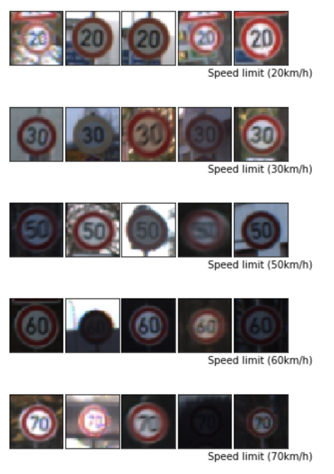
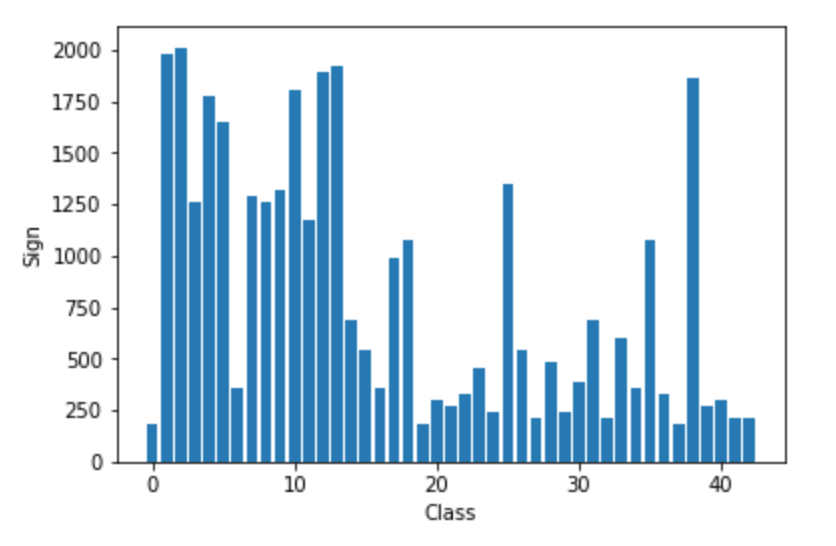
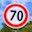
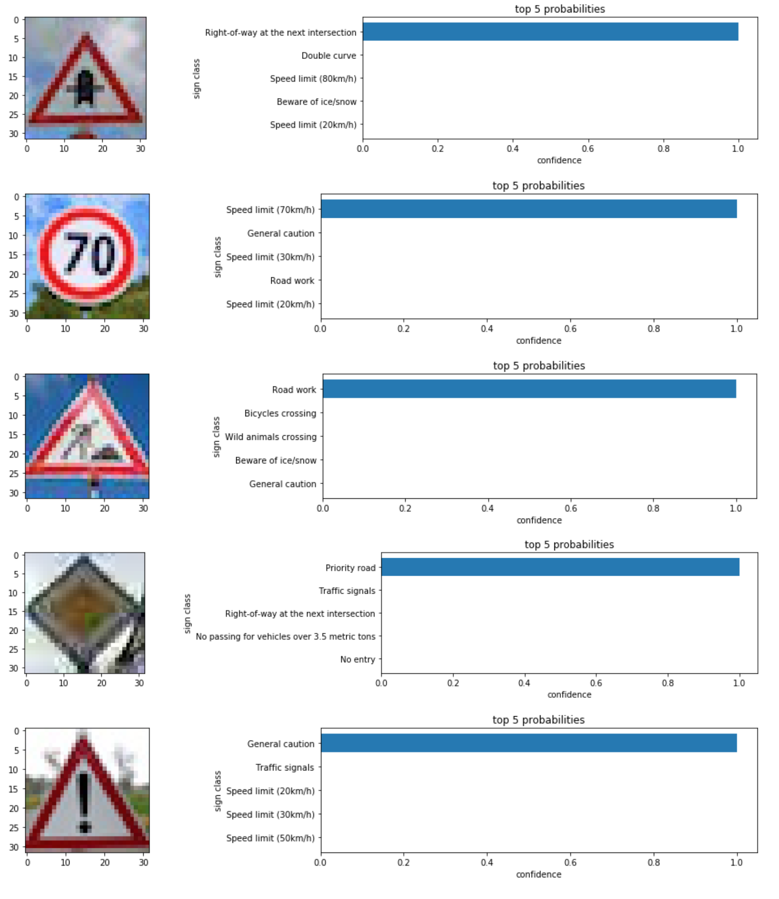

# **Traffic Sign Recognition** 

---

**Build a Traffic Sign Recognition Project**

The goals / steps of this project are the following:
1. Load the data set (see below for links to the project data set)
2. Explore, summarize and visualize the data set
3. Design, train and test a model architecture
4. Use the model to make predictions on new images
5. Analyze the softmax probabilities of the new images
6. Summarize the results with a written report

1 - 5 Are addressed in the exported notebook in [HTML](https://github.com/daniel1of1/CarND-Traffic-Sign-Classifier-Project/blob/master/Traffic_Sign_Classifier.html) and the original [Jupyter Notebook](https://github.com/daniel1of1/CarND-Traffic-Sign-Classifier-Project/blob/master/Traffic_Sign_Classifier.ipynb)

For 6 - keep reading.

---

## Rubric Points
### Here I will consider the [rubric points](https://review.udacity.com/#!/rubrics/481/view) individually and describe how I addressed each point in my implementation.  

### Writeup / README

#### 1. Provide a Writeup / README that includes all the rubric points and how you addressed each one.

You're reading it!

### Data Set Summary & Exploration

#### 1. Provide a basic summary of the data set.

I used numpy's `shape` method to answer most of the questions regarding number of samples (and of course their shapes).

To get the number of unique classes I used what seems to be a side effect of python's `set` which when given an array will keep only unique values... - so `len(set(label_data))` to get the unique labels.

| Set | operation | value
| --- | --- | --- |
| training | size | 347999
| validation | size | 12630
| testing | size | 4410
| images | shape | 32,32,3 (i.e 32x32px RGB image)
| classes | size | 43 

#### 2. Include an exploratory visualization of the dataset.

Here is an exploratory visualization of the data set. 5 random images from the first five classes (a long with their class names, the full list can be found in the notebook) and a bar chart showing the number of signs per class.

### Design and Test a Model Architecture

#### 1. Describe how you preprocessed the image data.

The only pre-processing step I took was to normalise the images to help the optimiser.

I had attempted to convert to a single channel (the Y in YUV) but ran into issues and decided to proceed with three channels as they were.

#### 2. Describe what your final model architecture looks like including model type, layers, layer sizes, connectivity, etc.) 
My final model consisted of the following layers:

| Layer         		|     Description	        					| 
|:---------------------:|:---------------------------------------------:| 
| Input         		| 32x32x3 RGB image   							| 
| Convolution 5x5     	| 1x1 stride, 'Valid' padding, outputs 28x28x36 	|
| RELU					|												|
| Max pooling	      	| 2x2 stride,  outputs 14x14x36 				|
| Convolution 5x5	    | 1x1 stride, outputs 10x10x42     									|
| RELU					|												|
| Max Pooling		| 2x2 stride, outputs 5x5x42        									|
| flatten		| outputs 1050        									|
| fully connected		| outputs 120        									|
| RELU					|												|
| dropout					|			rate 0.75							|
| Fully connected | outputs 84 |
| RELU | |
| Fully Connected | outputs 43 - Logits | 

#### 3. Describe how you trained your model. The discussion can include the type of optimizer, the batch size, number of epochs and any hyperparameters such as learning rate.

Hyper parameter | Value
--- | ---
Batch size | 128
Epochs | 40
Learning rate | 0.001
Mu and sigma for initial values | 0 and 0.1

I used the `Adam` optimiser - largely because that was what was used in the LeNet lab solution (see below for further discussion on that)

#### 4. Describe the approach taken for finding a solution and getting the validation set accuracy to be at least 0.93. 

My final model results were:
* validation set accuracy of **0.947**
* test set accuracy of **0.951**

The training and validation operations were taken from the LeNet lab solution as a starting point. They seemed perfectly suitable so did not change much at all.

I started with the LeNet model. I first trained on this as a benchmark of sorts. This was underfitting as I was not getting any validation accuracy more than 0.86. I then proceeded to try to replicate the architecture found in [this paper](http://yann.lecun.com/exdb/publis/pdf/sermanet-ijcnn-11.pdf) as was linked in the project.

However soon after modifying and adding some regularisations I was able to achieve > 0.93 accuracy, and decided to leave it at that with a mind to revisit when I do not have impending deadlines :).

Modifying hyper parameters, dropout rates and the like were realised by little more than trial and error. An extremely inefficient, human powered hyper parameter optimiser. 

The model worked **better** on the test set than it did on the validation set at it's best epoch which implies the solution is not overfitting (and still somewhat under fitting).
 

### Test a Model on New Images

#### 1. Choose five German traffic signs found on the web and provide them in the report. For each image, discuss what quality or qualities might be difficult to classify.

Here are five German traffic signs that I found on the web and cropped to 32x32:

   
 

As it turns out they all seem to be highly visible, so hopefully the model predicts them well.

#### 2. Discuss the model's predictions on these new traffic signs and compare the results to predicting on the test set. 

The predictions can be seen in the `matplotlib` output below.

The model was able to correctly guess 5 of the 5 traffic signs, which gives an accuracy of 100%. This compares favourably to the accuracy on the test set of 95%.

#### 3. Describe how certain the model is when predicting on each of the five new images by looking at the softmax probabilities for each prediction.

A visual indication of the results can be seen above, the model was almost 100% confident about every one of it's predictions. I suppose this is somewhat to be expected given the relative clarity of the images.

